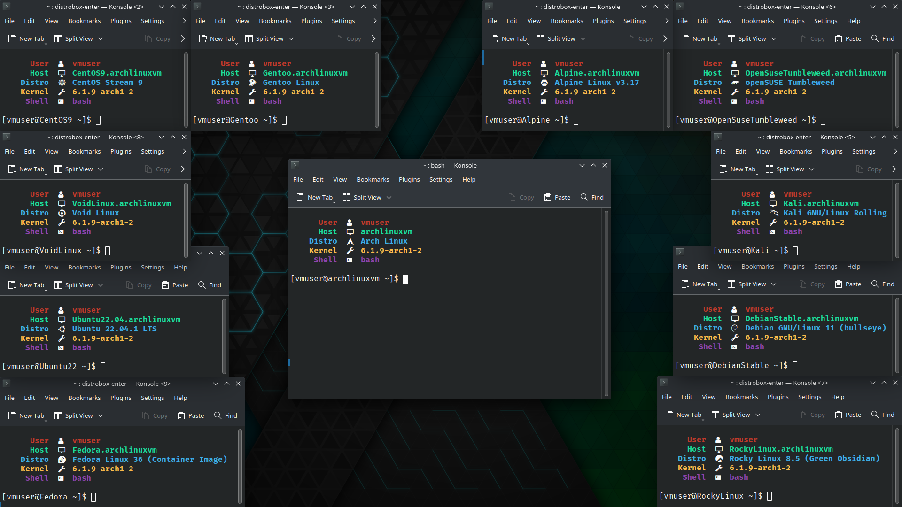
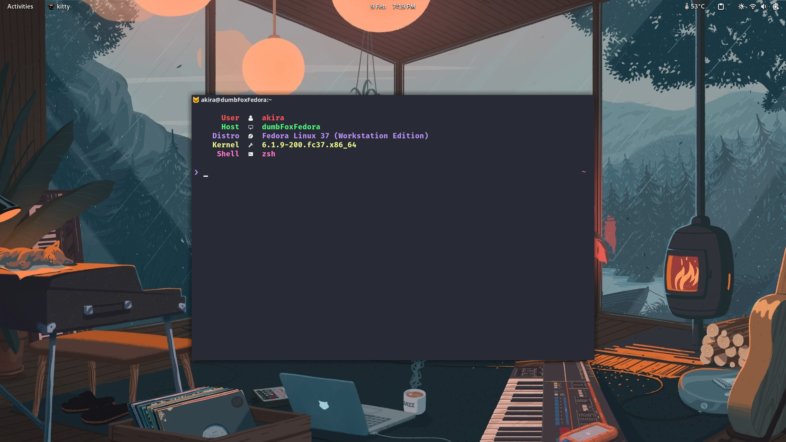

# Mitch: a minimal and colorful system information fetching tool written in C




> **Disclaimer**: this is a personal project. I will still try to answer to/fix
> issues ASAP.

Mitch (which stands for "Mini Fetch" or "Minimal Fetch") is yet another Unix
system information fetching tool written in C, designed to have minimal footprint
(~30kb) and a minimal but colorful design.

## Requirements

* `gcc` to compile the program and for the needed libraries
* `make`
* A font patched with [Nerd Fonts](https://www.nerdfonts.com/) (I'm using
[Fira Code](https://github.com/ryanoasis/nerd-fonts/tree/master/patched-fonts/FiraCode))

## Compiling

Clone this repository

```bash
git clone https://github.com/thatAkiraFox/mitch.git
```

Change to the cloned directory and compile the program using `make`

```bash
cd mitch/
make
```

You'll find a new executable called `mitch` in the current directory, you can
execute it with `./mitch` or you can place it in a folder in `$PATH` to make
it executable from every location.

## Configuration and Documentation

Well, the code is so barebones and simple that there's no frontend or config
file like in other similar utilities.

I still commented the code as much as possible to help everyone understand what
I did and why I did it, so you just need to understand my mess and then play
around with the code until you get what you want :thinking:

If you have issues understanding parts of the code you can open an issue and I
will answer as soon as I can.

## General Questions

### Why C?

It's pretty much the only language I know well enoguh, and is also the one I've
worked with the longest.

Ports to other languages *could* happen, maybe as a challenge for myself, but
don't hold your breath :skull:

### Windows wen????

Probably never, my PC only has Fedora installed and I'm not willing to maintain
a software for an OS that I don't actively use.

## Thanks

* [Nerd Fonts](https://www.nerdfonts.com/) for the icons
* [RabaDabaDoba](https://gist.github.com/RabaDabaDoba/145049536f815903c79944599c6f952a)
for the full table of supported color codes in C
* The lads on Stack Overflow
